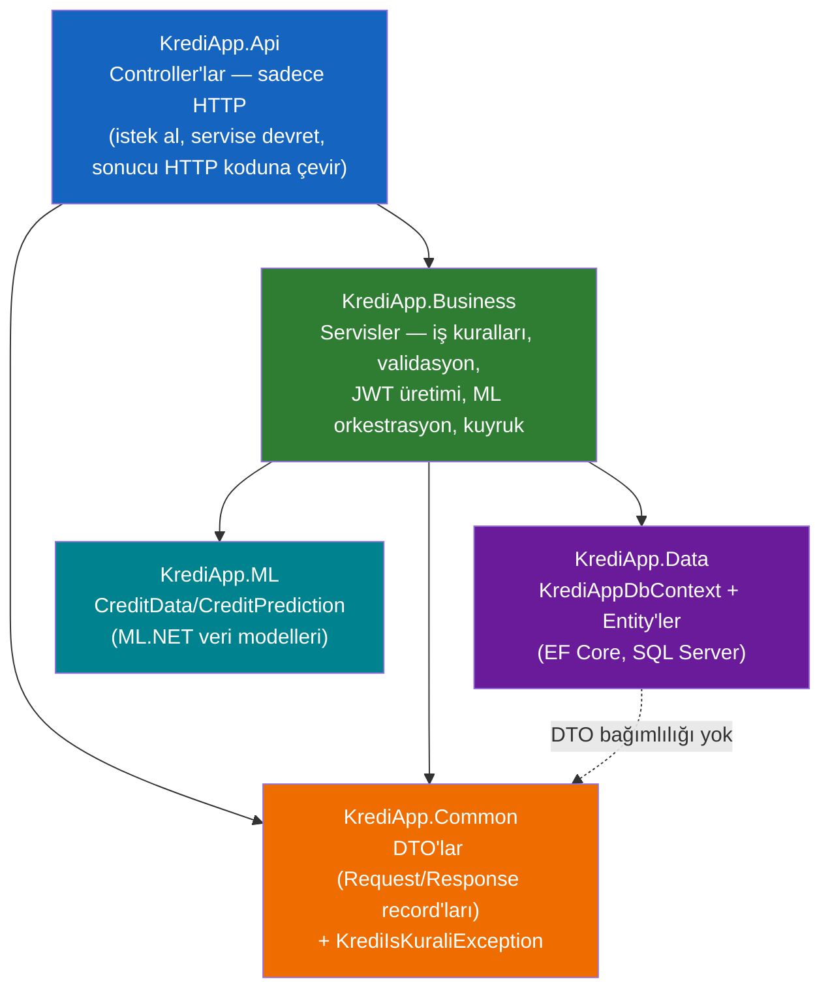
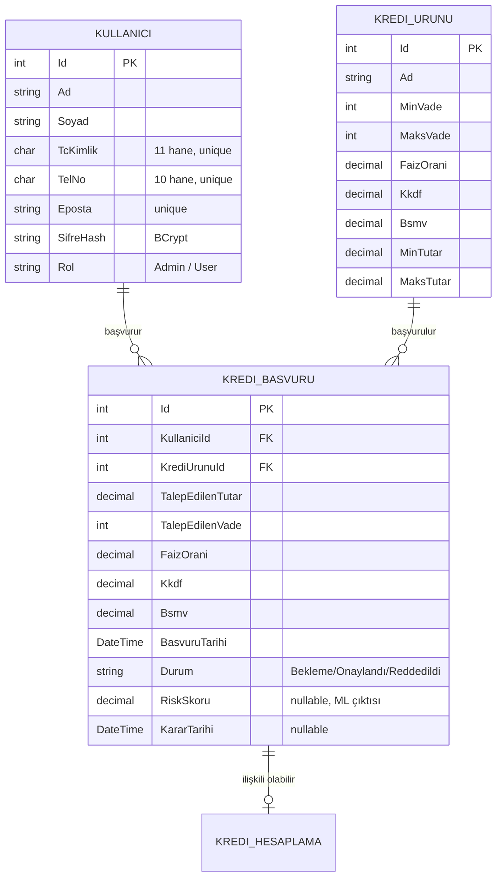
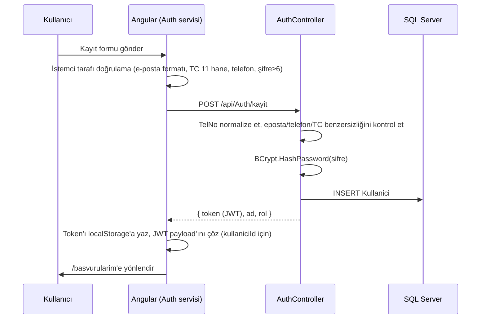
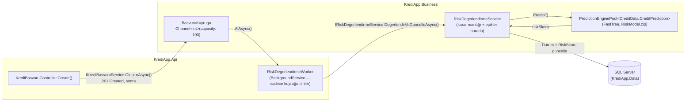

# KrediApp-v2 — Proje Mimarisi ve Mülakat Notları

> **Hazırlayan:** Doruk
> **Tarih:** 8 Temmuz 2026 (v2 — katmanlı mimariye geçiş)
> **Not:** Bu döküman, `KrediApp-v2` klasöründeki **gerçek, çalışan** koddan üretildi. İlk sürüm tek projeli (Controller → DbContext doğrudan) bir mimariyi anlatıyordu; staj müdürünün talebiyle proje **N-tier (katmanlı) mimariye** geçirildi — aşağıdaki §3 bu geçişi anlatıyor.

---

## 1. Proje Ne Yapıyor?

KrediApp, bir bankanın kredi başvuru sürecini uçtan uca simüle eden bir web uygulaması:

- Ziyaretçi **giriş yapmadan** kredi hesaplama (aylık taksit, itfa/amortisman tablosu) yapabilir.
- Kayıtlı bir kullanıcı kredi **başvurusu** oluşturabilir.
- Başvuru arka planda bir **makine öğrenmesi modeli** ile otomatik değerlendirilir; düşük riskli başvurular otomatik onaylanır, yüksek riskli olanlar otomatik reddedilir, arada kalanlar admin'in manuel kararına düşer.
- Admin paneli: ürün yönetimi (kredi türleri) + filtrelenebilir raporlar (arama, durum, tarih aralığı, PDF/Excel dışa aktarım, amortisman detayı, onay/red).

Bunu neden yaptık: Doruk, `kredihesap` adlı eski, daha karmaşık N-tier bir projeyi öğrenme amaçlı **sıfırdan, daha sade bir mimariyle** yeniden yazıyor — TDD ile, adım adım, her parçayı gerçek tarayıcıda test ederek.

---

## 2. Teknoloji Yığını

### Backend
| Teknoloji | Versiyon | Neden |
|---|---|---|
| .NET / ASP.NET Core Web API | **10** | En güncel LTS sonrası sürüm; minimal API değil, klasik Controller yaklaşımı (daha okunur, mülakatta anlatması kolay) |
| Entity Framework Core | 10.x, SQL Server provider | Code-first değil — **Database First** (`Scaffold-DbContext`), çünkü veritabanı önce SSMS'te elle tasarlandı |
| MS SQL Server | Developer/Express, local instance | İlişkisel bütünlük (foreign key, unique constraint) gerçek bir kısıt olarak istendi |
| JWT (Microsoft.AspNetCore.Authentication.JwtBearer) | — | Gerçek kimlik doğrulama; eski projedeki mock `X-Role` header yaklaşımının yerine |
| ML.NET (FastTree) | — | Kredi risk skoru tahmini |
| `System.Threading.Channels` | — | Bounded channel ile üretici-tüketici kuyruğu (BasvuruKuyrugu) |
| BCrypt.Net | — | Şifre hash'leme |

### Frontend
| Teknoloji | Versiyon | Neden |
|---|---|---|
| Angular | **21** (standalone components) | NgModule yok, her component kendi `imports:` dizisini taşıyor |
| Signals (`signal`, `computed`) | Angular core | Reaktif state yönetimi; RxJS sadece HTTP çağrılarında |
| Vitest (`@angular/build:unit-test`) | — | Angular'ın yeni test koşucusu; `HttpTestingController` ile HTTP mocklama |
| jsPDF + jspdf-autotable, xlsx | — | Raporları PDF/Excel olarak dışa aktarma |
| Plain SCSS (Angular Material **yok**) | — | Elle yazılmış, özel bir tasarım sistemi — teal/slate palet, Inter fontu, kart gölgeleri, custom slider |

**Eski projeden bilinçli farklar:** Angular Material yerine sıfırdan SCSS, mock rol header'ı yerine gerçek JWT.

---

## 3. Solution Yapısı — N-Tier Katmanlı Mimari

İlk sürümde tek bir `KrediApp.Api` projesi vardı; controller'lar doğrudan `DbContext`'e erişiyordu. **Staj müdürünün talebiyle** proje 4 ayrı katman projesine ayrıldı — her biri kendi `.csproj`'una sahip, bağımlılıklar tek yönlü akıyor:



```
KrediApp-v2/
├── KrediApp.Api/                     # İnce Web API — sadece HTTP sorumluluğu
│   ├── Controllers/
│   │   ├── AuthController.cs         # IAuthService'e delege eder
│   │   ├── KrediUrunuController.cs   # IKrediUrunuService'e delege eder
│   │   ├── KrediBasvuruController.cs # IKrediBasvuruService'e delege eder
│   │   ├── KrediHesaplamaController.cs
│   │   └── KullaniciController.cs
│   ├── RiskDegerlendirmeWorker.cs    # BackgroundService — sadece kuyruğu dinler, IRiskDegerlendirmeService'i çağırır
│   ├── RiskModel.zip
│   └── Program.cs                    # DI kayıtları (Business servisleri + DbContext), JWT, CORS
│
├── KrediApp.Business/                # İş mantığı — controller'lardan taşınan validasyon/orkestrasyon
│   ├── Interfaces/                   # IAuthService, IKullaniciService, IKrediUrunuService,
│   │                                 # IKrediBasvuruService, IKrediHesaplamaService, IRiskDegerlendirmeService
│   ├── Services/                     # Interface'lerin implementasyonları
│   ├── Telefon/TelefonNumarasi.cs    # Tek kanonik telefon normalizasyon kuralı
│   │                                 # (önceden AuthController + KullaniciController'da ayrı ayrı kopyalıydı)
│   └── Kuyruk/BasvuruKuyrugu.cs      # Channel<int> tabanlı bounded kuyruk (Singleton)
│
├── KrediApp.Data/                    # Veri erişim katmanı
│   ├── Entities/                     # Kullanici.cs, KrediUrunu.cs, KrediBasvuru.cs, KrediHesaplama.cs
│   └── KrediAppDbContext.cs          # Fluent API konfigürasyonu (OnModelCreating)
│
├── KrediApp.Common/                  # Katmanlar arası paylaşılan sözleşme
│   ├── Dtos/                         # KullaniciKayitRequest, KrediBasvuruCreateRequest, GirisYaniti, vb.
│   └── Exceptions/KrediIsKuraliException.cs  # İş kuralı ihlali → Api'de 400'e çevrilir
│
├── KrediApp.ML/                      # Paylaşılan ML veri modelleri (CreditData, CreditPrediction)
├── KrediApp.ML.Trainer/              # Model eğitim konsol uygulaması
├── KrediApp.KuyrukDenemesi/          # Kuyruk/worker desenini izole denemek için kullanılan konsol taslağı
│
├── kredi-app-client/                 # Angular 21 SPA (katman ayrımından etkilenmedi — API sözleşmesi aynı kaldı)
│
└── statlog+german+credit+data/       # UCI German Credit Dataset
```

**Katman kuralları (mülakatta savunulabilir olması için netleştirildi):**
1. **Controller'lar** hiçbir zaman `DbContext`'e veya entity CRUD mantığına doğrudan dokunmaz — sadece bir Business interface'i enjekte eder, DTO alır/döner, `KrediIsKuraliException`'ı `BadRequest`'e çevirir.
2. **Business servisleri** `DbContext`'i kullanır (Data'ya bağımlı), iş kurallarını uygular, DTO ↔ Entity dönüşümünü (bu projede minimal, çünkü entity'ler zaten iç yapıyı fazla sızdırmıyor) yönetir.
3. **Data katmanı** hiçbir üst katmanı bilmez — sadece EF Core entity'leri ve `DbContext`.
4. **Common**, hem Api hem Business tarafından referans alınır ama kendisi hiçbir şeye bağımlı değildir (sızdırmaz sözleşme katmanı).

**Bilinçli kapsam kararı:** Entity'ler (`KrediUrunu`, `KrediBasvuru` gibi) doğrudan HTTP yanıtlarında dönüyor — her entity için ayrı bir Response DTO'su (`KrediUrunuDto` vb.) **yazılmadı**. Sadece komut/istek tarafında (kayıt, başvuru oluşturma, durum güncelleme) DTO var. Bu, "DTO'suz Repository" ile "tam DTO katmanı" arasında bilinçli bir orta nokta — projenin ölçeğinde entity'lerin dışa sızması gerçek bir risk taşımıyor (iç implementasyon detayı = dış sözleşme burada aynı), ama gerekirse `Common/Dtos/`e response DTO'ları eklemek tek katmanlık bir iş.

---

## 4. Veritabanı Şeması



**Dikkat çeken detay — `TelNo char(10)`:** Bu alan sabit 10 karakterlik, başında `0` olmayan bir format bekliyor. Kayıt formunda kullanıcılar doğal olarak Türkiye formatını (`0` + 10 hane = 11 karakter) yazınca bu bir **500 hatasına** (SQL truncation) yol açıyordu. Çözüm: `KrediApp.Business/Telefon/TelefonNumarasi.cs` içinde **tek bir kanonik normalizasyon fonksiyonu** var (rakam dışı karakterleri temizle, baştaki tek `0`'ı at, 10 haneye zorla); hem `AuthService` hem `KullaniciService` bunu çağırıyor. Katmanlı mimariye geçmeden önce bu kural `AuthController` ve `KullaniciController`'da ayrı ayrı kopyalanmıştı — N-tier geçişi bu tekrarı da ortadan kaldırdı.

---

## 5. Kimlik Doğrulama Akışı



- Token, `nameidentifier`, `name`, `role` claim'lerini taşıyor.
- `authGuard` (herhangi bir giriş) ve `adminGuard` (rol=Admin) fonksiyonel `CanActivateFn` olarak yazıldı.
- `auth-interceptor.ts` her isteğe `Authorization: Bearer <token>` header'ı ekliyor.
- **Bilinçli sınırlama:** Kredi hesaplama herkese açık (giriş gerektirmiyor), başvuru oluşturma giriş gerektiriyor. Bu karar, eski projenin "sahte admin/user mod değiştirme butonu" yaklaşımının yerine gerçek yetkilendirmeyle geldi.

---

## 6. Asenkron Risk Değerlendirme Mimarisi



**Karar eşikleri** (`KrediApp.Business/Services/RiskDegerlendirmeService.cs`):
| Olasılık | Karar |
|---|---|
| `< 0.10` | Otomatik Onay |
| `0.10 – 0.90` | Bekleme (admin manuel karar verir) |
| `> 0.90` | Otomatik Red |

**Katmanlı mimarideki ayrım:** `RiskDegerlendirmeWorker` (Api'de kalır — çünkü `BackgroundService`/hosting bir ASP.NET Core kavramı) artık sadece kuyruğu dinleyip Business'taki `IRiskDegerlendirmeService`'i çağırıyor. Karar eşikleri, ML tahmini ve veritabanı güncellemesi tamamen Business katmanında — bu sayede worker'ı çalıştırmadan (host başlatmadan) bu mantığı izole test etmek mümkün.

**Bilinen kısıt:** Başvuru formu, German Credit Dataset'in 20 özelliğinin tamamını toplamıyor (yaş, medeni durum, mülk durumu gibi alanlar formda yok). Eksik özellikler `RiskDegerlendirmeService.cs` içinde sabit varsayılan kategorik kodlarla dolduruluyor. Bu, mülakatta doğrudan sorulabilecek bir zayıflık — aşağıda ayrıca ele alındı.

---

## 7. Frontend Mimarisi

### 7.1 Sayfa/servis ayrımı

- **`core/`** — HTTP servisleri (`kredi-urunu.ts`, `kredi-basvuru.ts`, `auth.ts`) ve **saf fonksiyonlar** (`pmt-hesaplama.ts`, `amortisman-tablosu.ts`, `durum-yardimci.ts`). Saf fonksiyonlar component'ten bağımsız, izole test edilebilir.
- **`pages/`** — her sayfa kendi component + template + stil + spec dörtlüsüne sahip; router seviyesinde standalone import ediliyor (lazy değil, proje küçük olduğu için gerekmedi).

### 7.2 Hesaplama sayfası — canlı, sunucusuz önizleme

`Hesaplama` component'i, kredi ürünü seçildiğinde detay kartı + iki slider (tutar/vade) gösterir; her değişiklikte **frontend'de** (`pmtHesapla()` saf fonksiyonu ile, API çağrısı yapmadan) taksit yeniden hesaplanır. Aralık dışı bir değer girilirse otomatik sınırlanır ve bir toast uyarısı gösterilir.

`BasvuruOlustur` component'i neredeyse aynı deseni tekrarlıyor — bu, mimari incelemede "iki adaptör = gerçek dikiş" olarak işaretlendi (bkz. §9).

### 7.3 Test stratejisi

Vitest ile 60+ test: saf fonksiyonlar (pmt-hesaplama, amortisman-tablosu, durum-yardimci) için doğrudan birim testleri; component'ler için `TestBed` + `HttpTestingController` ile HTTP mock'lanmış entegrasyon-stili testler. Guard'lar `TestBed.runInInjectionContext()` ile test edildi.

---

## 8. Uygulanan Tasarım Kararları / Desenler

| Desen | Nerede | Neden |
|---|---|---|
| Producer-Consumer (bounded channel) | `BasvuruKuyrugu` + `RiskDegerlendirmeWorker` | Risk değerlendirmesi HTTP isteğini bloklamasın diye |
| Background Service (Hosted Service) | `RiskDegerlendirmeWorker` | Uygulama yaşam döngüsüyle birlikte sürekli çalışan worker |
| Object Pool | `PredictionEnginePool` | ML.NET'in thread-safe olmayan `PredictionEngine`'ini güvenli paylaşmak için |
| N-Tier / Katmanlı Mimari | `Api → Business → Data`, `Common` paylaşılan sözleşme | Controller'ları HTTP'ye, iş kurallarını Business'a, veri erişimini Data'ya izole etmek — staj müdürünün talebiyle eklendi |
| Interface + Implementation ayrımı | `Business/Interfaces/*` + `Business/Services/*` | Controller'lar somut sınıfa değil soyutlamaya bağımlı — ileride servisleri mock'layarak controller testi yazmak mümkün |
| Exception-tabanlı iş kuralı sinyali | `KrediIsKuraliException` (Common) | Business, HTTP'yi bilmeden hata üretir; Api bunu 400'e çevirir — katmanlar arası sızıntı yok |
| Saf fonksiyon + component ayrımı | `pmt-hesaplama.ts`, `amortisman-tablosu.ts` | İş mantığını Angular'dan bağımsız, izole test edilebilir kılmak |
| Functional Guard/Interceptor | `auth-guard.ts`, `auth-interceptor.ts` | Angular'ın modern (class tabanlı olmayan) yaklaşımı |
| Signals | Component state | RxJS'in `BehaviorSubject`+`async pipe` yükü olmadan reaktif UI |
| Standalone Components | Tüm frontend | NgModule bağımlılığı yok |

---

## 9. Bilinen Sınırlamalar (mülakatta dürüstçe konuşulabilecek noktalar)

1. **`GET /api/KrediBasvuru` yetkisiz veri sızıntısı riski taşıyor** — hem admin raporları hem normal kullanıcının "başvurularım" sayfası aynı endpoint'i kullanıyor ama backend kullanıcıya göre filtrelemiyor; şu an frontend tüm listeyi çekip (potansiyel olarak) filtreliyor. Düzeltme: `IKrediBasvuruService.TumunuGetirAsync()`'e kullanıcı bazlı filtre parametresi eklemek — katman ayrımı sayesinde bu artık tek bir Business metodunda yapılacak bir değişiklik.
2. **Risk modeli eksik özelliklerle çalışıyor** — form 20 özelliğin tamamını toplamıyor, eksikler sabit varsayılanlarla dolduruluyor. Bu, tahmin kalitesini sessizce düşürüyor. Düzeltme yönü: eksik alan sayısı belli bir eşiği geçerse otomatik karar verilmesin, direkt manuel incelemeye düşsün.
3. **Frontend'de tekrarlanan doğrulama deseni** — `Hesaplama` ve `BasvuruOlustur` sayfaları "sınırla + uyar" mantığını bağımsız kopyalamış (mimari inceleme raporunda "Strong" öncelikli aday olarak işaretlendi; backend tarafında eşdeğeri olan telefon-normalizasyon tekrarı N-tier geçişiyle giderildi, frontend tarafı henüz giderilmedi).
4. **Business katmanında henüz birim testi yok** — controller'lar ince hale geldi ve servisler interface arkasında olduğu için artık mock `DbContext`/in-memory provider ile test edilebilir durumdalar, ama bu testler henüz yazılmadı. Bir sonraki adım.
5. **appsettings.json içinde bağlantı dizesi/JWT secret'ı düz metin** — geliştirme ortamı için kabul edilebilir, production'a taşınırsa ortam değişkenine/secret store'a alınmalı.

---

## 10. Mülakat Soru-Cevap Provası

### Genel mimari

**S: Neden 4 katmana (Api/Business/Data/Common) ayırdınız, tek projede kalamaz mıydı?**
> C: İlk sürümde tek projeydi ve bilinçli bir tercihti — 5 controller, 4 entity için katman ayrımı erken soyutlama olurdu. Ama proje büyüdükçe (ve staj müdürümün de talebiyle) somut bir maliyeti ortaya çıktı: telefon numarası normalizasyon mantığı `AuthController` ve `KullaniciController`'da ayrı ayrı kopyalanmıştı, biri güncellenip diğeri unutulunca gerçek bir üretim hatası (500 truncation hatası) çıktı. Bu, "controller'lar iş mantığını doğrudan taşıyor" probleminin somut kanıtıydı. Katmanlara ayırınca o kural artık `KrediApp.Business/Telefon/TelefonNumarasi.cs`'te tek yerde.

**S: Katmanlar arasında ne akıyor, entity'ler mi DTO'lar mı?**
> C: İkisi birden, bilinçli bir ayrımla. Common katmanında sadece **istek/komut** DTO'ları var (`KullaniciKayitRequest`, `KrediBasvuruCreateRequest` gibi) — bunlar HTTP gövdesinin şeklini Business'tan/Data'dan bağımsızlaştırıyor. **Yanıt** tarafında ise entity'ler doğrudan dönüyor; her entity için ayrı bir Response DTO'su yazmadım çünkü bu ölçekte entity'lerin dışa sızması gerçek bir risk taşımıyor — gerekirse tek katmanlık bir ek iş.

**S: Business katmanı Data'ya nasıl bağımlı, DbContext'i doğrudan mı kullanıyor?**
> C: Evet, `KrediAppDbContext`'i doğrudan enjekte ediyor — repository pattern eklemedim çünkü EF Core'un `DbSet<T>` API'si zaten repository+unit-of-work'ün sağladığı soyutlamayı veriyor; üstüne bir repository katmanı eklemek bu ölçekte "soyutlamanın soyutlaması" olurdu. Test edilebilirlik için asıl kritik olan, controller'ların DbContext'i **görmemesi** — bunu interface (`IKrediBasvuruService` vb.) ile sağladım.

**S: Bu mimari nasıl büyür? 10x kullanıcıya, 10x controller'a çıksa ne değişirdi?**
> C: Şu an her Business servisi `DbContext`'i doğrudan kullanıyor; veri kaynağı çeşitlenirse (ör. bir kısmı NoSQL'e taşınırsa) repository pattern'i o zaman eklerim. `RiskDegerlendirmeWorker` gibi hosting'e bağlı parçaları Api'de, saf iş mantığını Business'ta tutmaya devam ederdim — bu ayrım zaten şu an net.

**S: Neden Entity Framework "Code First" değil "Database First"?**
> C: Veritabanı önce SSMS'te elle tasarlandı (foreign key'ler, unique constraint'ler, check'ler dahil), sonra `Scaffold-DbContext` ile entity'ler üretildi. Bu, şemanın veritabanı uzmanlığıyla (indeksleme, tip seçimi — ör. `char(10)` vs `varchar`) tasarlanmasını sağladı; ama entity sınıflarının veritabanı şemasına sıkı bağımlı olması riskini de getirdi — şema değiştiğinde scaffold'ı yeniden çalıştırmak gerekiyor.

### Kimlik doğrulama & güvenlik

**S: JWT'yi nasıl doğruluyorsunuz, refresh token var mı?**
> C: `Microsoft.AspNetCore.Authentication.JwtBearer` ile issuer/audience/lifetime/signing-key doğrulanıyor. Refresh token **yok** — bu bilinçli bir kapsam kısıtlaması, öğrenme projesi olduğu için access token süresi dolunca kullanıcı yeniden giriş yapıyor. Gerçek bir üretim sisteminde refresh token + rotation eklerdim.

**S: Şifreler nasıl saklanıyor?**
> C: BCrypt ile hash'leniyor (`BCrypt.Net.BCrypt.HashPassword`), salt otomatik BCrypt tarafından üretiliyor. Düz metin şifre hiçbir yerde loglanmıyor/saklanmıyor.

**S: Frontend'de JWT payload'ını nasıl okuyorsunuz?**
> C: `atob(token.split('.')[1])` ile base64 decode edip `nameidentifier` claim'ini okuyoruz (`auth.ts`). Bu kırılgan bir yaklaşım — token formatı değişirse veya üç parçalı değilse sessizce patlayabilir. Şu an tek kullanım noktası olduğu için kabul edilebilir risk, ama ikinci bir kullanım noktası eklenirse (ör. admin sayfasında rol okuma) doğrulamalı, merkezi bir `TokenDecoder` yardımcı fonksiyonuna çıkarırdım.

**S: `GET /api/KrediBasvuru` neden hem admin hem normal kullanıcı için aynı endpoint?**
> C: Bu bilinen bir eksik — endpoint şu an kullanıcıya göre filtrelemiyor, `[Authorize(Roles="Admin")]` da yok. Düzeltmesi: backend'de JWT'deki `kullaniciId`'yi okuyup admin değilse sadece o kullanıcının başvurularını döndürmek.

### Makine öğrenmesi

**S: Neden FastTree, neden başka bir algoritma değil?**
> C: German Credit Dataset ikili sınıflandırma (iyi/kötü kredi) problemi; FastTree (Gradient Boosted Trees), ML.NET'in bu tip tablo verisi için hazır, iyi performans gösteren bir binary classifier'ı. Küçük/orta boy tablo verisinde derin öğrenmeye göre daha az veri ile daha iyi genelleme yapar, eğitim süresi de kısa.

**S: Model kaç özellik kullanıyor, hepsi başvuru formundan mı geliyor?**
> C: Hayır — model 20 özellikle eğitildi ama başvuru formu sadece tutar ve vadeyi topluyor. Eksik 18 özellik Business katmanındaki `RiskDegerlendirmeService.cs` içinde sabit varsayılan kategorik kodlarla dolduruluyor. Bu bilinen bir sınırlama; gerçek bir üretim sisteminde ya form genişletilir ya da eksik veri oranına göre otomatik karar devre dışı bırakılır.

**S: Tahmin senkron mu yapılıyor, kullanıcı bekliyor mu?**
> C: Hayır, asenkron. Başvuru oluşturulunca `201 Created` hemen dönüyor, başvuru ID'si bir `Channel<int>` kuyruğuna (`BasvuruKuyrugu`, Business katmanında) yazılıyor. Api'deki `RiskDegerlendirmeWorker` (bir `BackgroundService`) kuyruğu dinliyor ama kendisi hiçbir karar mantığı içermiyor — sadece Business'taki `IRiskDegerlendirmeService`'i çağırıyor. Karar mantığını hosting'den ayırmamın sebebi: worker'ı çalıştırmadan (yani ASP.NET Core host'unu ayağa kaldırmadan) risk kararını birim testle doğrulayabilmek.

**S: `PredictionEnginePool` neden gerekli, doğrudan `PredictionEngine` kullanılamaz mıydı?**
> C: ML.NET'in `PredictionEngine`'i thread-safe değil. Web API çoklu isteği paralel işlediği için, tek bir `PredictionEngine` örneğini paylaşmak veri yarışına (race condition) yol açar. `PredictionEnginePool`, havuzlama yaparak her tahmin çağrısı için güvenli bir örnek sağlıyor; ayrıca `watchForChanges: true` ile model dosyası (`RiskModel.zip`) güncellenince uygulamayı yeniden başlatmadan yeni modeli yükleyebiliyor.

### Frontend

**S: Neden Angular Material kullanmadınız?**
> C: Öğrenme amaçlı bir tercih — CSS/tasarım sistemini sıfırdan yazmak istedim (renk paleti, gölgeler, custom slider, durum rozetleri). Angular Material daha hızlı geliştirme sağlardı ama "her pikselin nereden geldiğini bilme" hedefiyle çelişirdi.

**S: State yönetimi için neden NgRx/Redux değil Signals?**
> C: Proje ölçeğinde global, karmaşık state yok — her sayfa kendi verisini yönetiyor, paylaşılan state sadece `Auth` servisindeki oturum bilgisi. Signals, NgRx'in boilerplate'i (action/reducer/effect) olmadan aynı reaktiviteyi sağlıyor. NgRx'i, sayfalar arası paylaşılan karmaşık state (ör. çok adımlı bir sihirbaz) ortaya çıkarsa değerlendiririm.

**S: Kredi hesaplama sonucu nasıl "canlı" güncelleniyor, her seferinde backend'e mi gidiyor?**
> C: Hayır — taksit hesaplama formülü (`pmt-hesaplama.ts`) hem backend'de (gerçek başvuru kaydı için) hem frontend'de (anlık önizleme için) ayrı ayrı implemente edilmiş saf bir fonksiyon. Slider hareket ettikçe frontend kendi hesaplıyor, API çağrısı yok. Bu bilinçli bir trade-off: iki yerde aynı formülün senkron kalması gerekiyor (test edilerek doğrulandı), ama kullanıcı deneyimi anlık.

**S: Testleri nasıl yazdınız — uçtan uca mı, birim mi?**
> C: Karma: saf fonksiyonlar (`pmt-hesaplama`, `amortisman-tablosu`, `durum-yardimci`) için doğrudan birim testleri; component'ler için `TestBed` + `HttpTestingController` ile HTTP'yi mock'layan entegrasyon-stili testler (gerçek DOM render, gerçek form etkileşimi). Ayrıca kritik akışları (kayıt→giriş→başvuru→admin onay) gerçek tarayıcıda (Chrome preview) elle de test ettim — testler doğru şeyi test ettiğini garantiler ama "gerçekten çalışıyor mu" sorusunun cevabı tarayıcıda.

### Genel / süreç

**S: Bu projeyi neden sıfırdan yeniden yazdınız, eskisini geliştirmediniz?**
> C: Öğrenme hedefliydi — eski proje (`kredihesap`) referans olarak duruyor ama değiştirilmiyor. Yeniden yazarken her kararı bilinçli verdim: JWT vs mock auth, tek proje vs N-tier, Signals vs NgRx, custom CSS vs Material. Bu, "neden böyle yaptım" sorusuna her seferinde net bir cevabım olmasını sağladı.

**S: TDD nasıl uyguladınız, gerçekten test-first mü yazdınız?**
> C: Dikey dilim (tracer bullet) yaklaşımı: tek bir davranış için test yaz → geç → bir sonraki davranış. Tüm testleri baştan yazıp sonra hepsini geçirmeye çalışmak yerine, her adımda gerçek davranışı doğrulayan tek bir test yazıp minimal kodla geçirdim. Bu, testlerin "hayali" davranışı değil gerçek davranışı test etmesini sağladı.

---

## 11. Kurulum

```powershell
# Backend
cd KrediApp.Api
dotnet run --launch-profile https
# → http://localhost:5089 (HTTP), https://localhost:7028 (HTTPS)

# Frontend
cd kredi-app-client
npm start
# → http://localhost:4200

# ML modelini yeniden eğitmek için
cd KrediApp.ML.Trainer
dotnet run
# → KrediApp.Api/RiskModel.zip günceller
```

**appsettings.json** içindeki `ConnectionStrings:KrediAppDb` local SQL Server instance'ına (Windows kimlik doğrulaması, `Trusted_Connection`) işaret ediyor.

---

## 12. Özet — Bu Proje Ne Kanıtlıyor?

- Gerçek JWT tabanlı kimlik doğrulama ve rol bazlı yetkilendirme kurabildiğimi.
- Asenkron, kuyruk tabanlı bir arka plan işleme hattı (Producer-Consumer + BackgroundService) tasarlayıp thread-safe ML servisiyle entegre edebildiğimi.
- Angular'ın modern (standalone, signals, functional guard/interceptor) yaklaşımlarını NgModule/RxJS'siz kullanabildiğimi.
- TDD ile, testleri gerçek davranışa göre yazarak geliştirme yapabildiğimi.
- Karşılaştığım gerçek bir üretim hatasını (telefon numarası truncation → 500) kök nedenine kadar takip edip hem backend hem frontend'de düzelttiğimi, ve bunu yaparken ortaya çıkan mimari tekrarı (iki controller'da aynı normalizasyon mantığı) fark edip dokümante ettiğimi.
- Mimarideki bilinen sınırlamaları (yetkisiz endpoint, eksik ML özellik verisi) gizlemek yerine açıkça işaretleyebildiğimi.
- Çalışan, testlerle doğrulanmış bir kod tabanını **kırmadan** N-tier mimariye geçirebildiğimi: `Api → Business → Data` + `Common` katmanlarına ayırırken API sözleşmesi (route'lar, DTO şekilleri) hiç değişmedi, bu yüzden frontend'de tek satır bile dokunmaya gerek kalmadı — sadece backend'i yeniden derleyip gerçek bir uçtan uca akışla (kayıt → giriş → başvuru → arka plan risk değerlendirmesi) davranışın aynı kaldığını doğruladım.
